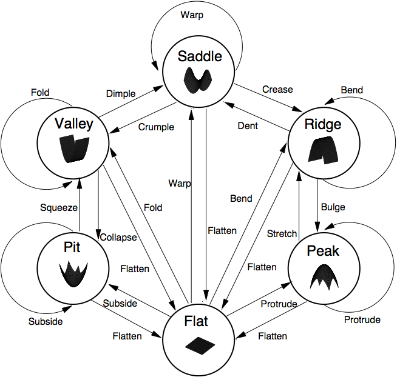

Registered Differential Features
=====

"A discretised set of 15 categorical labels to describe the changes in curvature over time."[1]

***

Table of Contents
-----------------

**[Introduction](#introduction)**

**[Theory](#theory)**

**[Implementation](#implementation)**

**[Application](#application)**

**[References](#references)**

***

Introduction
------------

Imagine a thin sheet of metal. Think of all the possible ways it could be distorted without tearing it... Then look at this diagram:   

 

In essense, there are *15 possible ways* that the surface can distort:

* Those that typify, and exemplify further, the formation of a prototypical form (e.g. *protrude* a peak, *subside* a pit, *fold* a valley, *bend* a ridge, *warp* a saddle).

* Those that move the opposite way from the prototype form towards flat (e.g. *flatten*). 

* Those bi-directional transitions that are also applicable only between neighbouring non-flat prototypes (e.g. to *squeeze* a pit to form a valley, to *collapse* a valley to form a pit, to *dimple* a valley to form a saddle, to *crumple* a saddle to form a valley, to *crease* a saddle to form a ridge, to *dent* a ridge to form a saddle, to *bulge* a ridge to form a peak, and *stretch* a peak to form a ridge).
  
* Those shapes that do not make any transition - as they have no observable change in curvature (e.g. they are *constant*).

This results in a total of *15 different deformation classes*, which we formalise as the **type** of deformation and the **extent** of change.


Theory
------

<!-- Use http://www.url-encode-decode.com/urlencode to encode equations -->

More precisely, consider the two principal curvatures centred on a surface neighbourhood. The principal curvatures are the two maximal changes in the form of the surface around that point. They have a direction and a magnitude of change. And they are orthogonal - i.e. at right angles to one another.

<!-- S=\frac{2}{\pi}arctan\left((\kappa_{1}+\kappa_{2})/(\kappa_{1}-\kappa_{2})\right) -->

<!-- C=\sqrt{(\kappa_{1}^{2}+\kappa_{2}^{2})/2}. -->

Now, consider how these two properties - the respective magnitutes of the principle curvatures - change w.r.t. one another. 


 

<!-- T\in[1,...,15] --> 

that can occur over any given duration as defined by the relative change in the principal curvatures: 

  

<!-- \Delta\kappa_{1} -->

and 

 

<!-- \Delta\kappa_{2} -->

As with the initial shape classes, in order to define the zero boundary region it is necessary to employ a threshold term: 


<!-- \Delta\kappa=0\iff-\theta_{change}<\Delta\kappa<\theta_{change} -->

We furthermore can define the extent of change: _E_ to also measure the degree to which this deformation occurs over the duration. 

 

<!-- E=\sqrt{\frac{\Delta\kappa_{1}^{2}+\Delta\kappa_{2}^{2}}{2}} -->


Implementation
-----------

```python
import cv 
import cv2
import numpy as np 

```

Application
-----------


References
----------

[1]: http://homepages.inf.ed.ac.uk/rbf/PAPERS/lukins06qualitative.pdf

[2]: J. J. Koenderink and A. J. van Doorn. Surface shape and curvature scales. Image and Vision Computing, 10(8):557– 565, 1992.

[3]: A. M. McIvor and R. J. Valkenburg. Principal frame and principal quadric estimation. Image and Vision Computing New Zealand, pages 55–60, 1996
